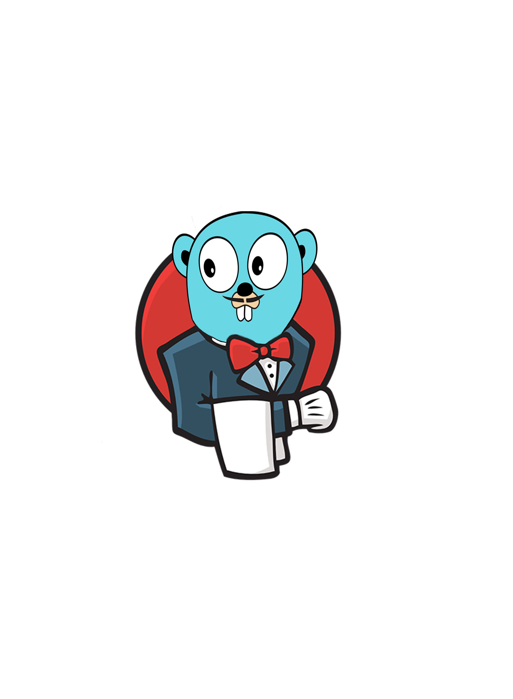

# Jenkins Go Module

A third-party go module for empowering go developers to be able to easily interact with a given Jenkins instance API. 

With a few short lines of code, kick off pipelines, stop pipelines, pass input to pipelines waiting for input, retrieve information about pipeline configuration and more!

The ability to manage Jenkins system configuration is soon to come!

Plus includes built in mock client to make unit testing easy.

## Installation

Use [go](https://golang.org/doc/install) to install the module.

```bash
go get github.com/skipikash/jenkins
```

## Usage

#### Start a Job
```go
package examples

import (
	"fmt"

	"github.com/skipikash/jenkins"
	"github.com/skipikash/jenkins/job"
)

func startMyJob() {
	// create client
	jc := jenkins.Client{
		JenkinsUsername: "username",
		JenkinsAPIToken: "apiToken",
	}

	// set parameters if job requires parameters, otherwise params := nil
	params := job.Parameters{
		job.Parameter{
			Name:  "MYPARAM",
			Value: "Hello World",
		},
	}

	myJobURL := "http://myjenkins:8080.mycompany.com/job/myJob"
	runningJobUrl, _ := job.Start(jc, params, myJobURL)

	fmt.Printf("%s is RUNNING!", runningJobUrl)
}
```

#### Watch a Job
The watch package is very useful for polling running jobs. Even use watch.JobWithInput to watch a job and automagically pass input once the pipeline requires it.
```go
package examples

import (
	"fmt"
	"time"

	"github.com/skipikash/jenkins"
	"github.com/skipikash/jenkins/watch"
)

func watchMyJob() {
	// create client
	// Note: to create JenkinsAPIToken view cloudbees documentation
	jc := jenkins.Client{
		JenkinsUsername: "username",
		JenkinsAPIToken: "apiToken",
	}

	// URL of running job
	runningJobURL := "http://myjenkins:8080.mycompany.com/job/myJob/1"

	// watch a job until completion, polling it every minute
	status, _ := watch.Job(jc, runningJobURL, time.Minute)
	fmt.Printf("%s finished with a status of %s!", runningJobURL, status)
}
```

## Testing with mock.Client
mock.Client comes preloaded with several mocked responses, however if you wish to add more to the mock.Client you can do that too!
```go
package examples

import (
	"testing"

	"github.com/skipikash/jenkins"
	"github.com/skipikash/jenkins/job"
	"github.com/skipikash/jenkins/mock"
)

func myFunc(jc *jenkins.Client, jobRunURL string) {
	job.GetRunInfo(jc, jobRunURL)
	job.Abort(jc, jobRunURL)
}

func TestMyFunc(t *testing.T) {
	myFunc(&mock.Client, mock.TestRunningJobURL)
}

// to add your own custom mock response
func TestSomethingElse(t *testing.T) {
	mock.AddResponse(&mock.Client, "GET", "/job/mycustomjobpath/api/json", mock.Response{
		StatusCode: 200,
		Bytes:      nil,
	})

	// now use mock.Client to make your requests
}
```